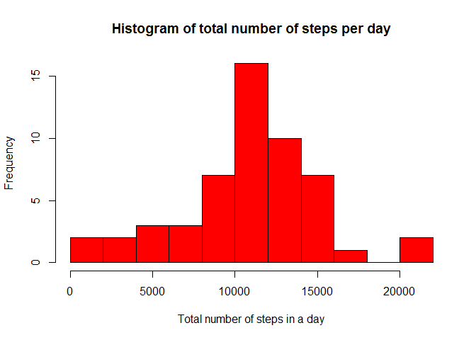
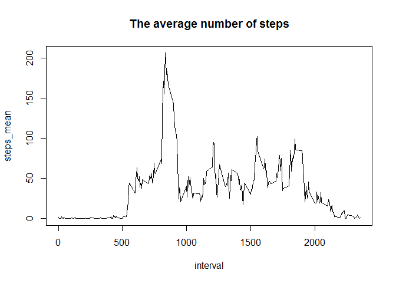
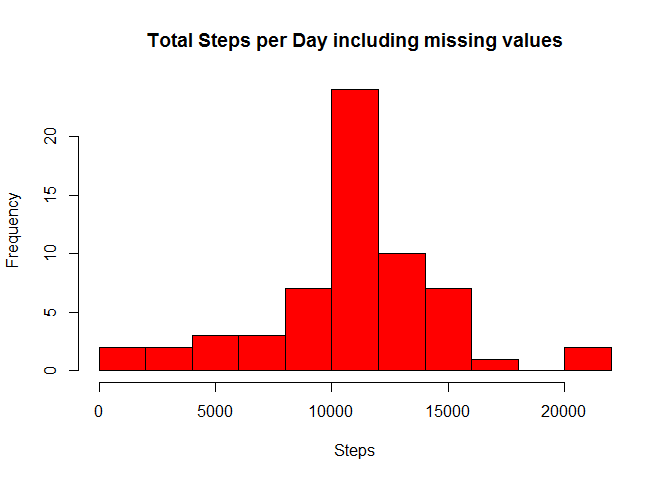

# Reproducible Research: Peer Assessment 1


## Loading and preprocessing the data

```r
unzip("activity.zip")
data <- read.csv("activity.csv")
```


## What is mean total number of steps taken per day?

```r
stepsDate <- aggregate(steps ~ date, data=data, FUN=sum)
library(ggplot2)
hist(stepsDate$steps, breaks=10, col="red", main="Histogram of total number of steps per day", xlab="Total number of steps in a day")
```

<!-- -->

## What is the mean and median of the total number of steps taken per day?

```r
mean(stepsDate$steps)
```

```
## [1] 10766.19
```

```r
median(stepsDate$steps)
```

```
## [1] 10765
```


## What is the average daily activity pattern?
Make a time series plot (i.e. type = "l") of the 5-minute interval (x-axis) and the average number of steps taken, averaged across all days (y-axis)

```r
stepsInterval_mean <- aggregate(steps ~ interval, data = data, FUN=mean, na.rm=TRUE)
names(stepsInterval_mean) <- c("interval", "steps_mean")
plot(stepsInterval_mean, type = "l", main="The average number of steps")
```

<!-- -->

Which 5-minute interval, on average across all the days in the dataset, contains the maximum number of steps?

```r
max_interval <- which.max(stepsInterval_mean$steps_mean)
stepsInterval_mean$interval[max_interval]
```

```
## [1] 835
```


## Imputing missing values

The total number of rows with missing values in the dataset

```r
sum(is.na(data$steps)) 
```

```
## [1] 2304
```
Missing values will be replaced by mean of steps in the same 5-min interval.


```r
new_data <- data
nas <- is.na(new_data$steps)
avg_interval <- tapply(new_data$steps, new_data$interval, mean, na.rm=TRUE, simplify=TRUE)
new_data$steps[nas] <- avg_interval[as.character(new_data$interval[nas])]
```

Check if there's any NA values. 

```r
sum(is.na(new_data$steps))
```

```
## [1] 0
```

Make a histogram of the total number of steps taken each day and Calculate and report the mean and median total number of steps taken per day. Do these values differ from the estimates from the first part of the assignment? What is the impact of imputing missing data on the estimates of the total daily number of steps?


```r
library(dplyr)
newDataSteps <- new_data %>%
			filter(!is.na(steps)) %>%
			group_by(date) %>%
			summarize(steps = sum(steps)) %>%
			print
```

```
## Source: local data frame [61 x 2]
## 
##          date    steps
##        (fctr)    (dbl)
## 1  2012-10-01 10766.19
## 2  2012-10-02   126.00
## 3  2012-10-03 11352.00
## 4  2012-10-04 12116.00
## 5  2012-10-05 13294.00
## 6  2012-10-06 15420.00
## 7  2012-10-07 11015.00
## 8  2012-10-08 10766.19
## 9  2012-10-09 12811.00
## 10 2012-10-10  9900.00
## ..        ...      ...
```

```r
hist(newDataSteps$steps, breaks=10, main="Total Steps per Day including missing values", xlab="Steps", ylab="Frequency", col = "red")
```

<!-- -->

New mean and median are calculated. Missing values have got the impact on those parameters.

```r
mean(newDataSteps$steps)
```

```
## [1] 10766.19
```
Median 

```r
median(newDataSteps$steps)
```

```
## [1] 10766.19
```

## Are there differences in activity patterns between weekdays and weekends?
Create a new factor variable in the dataset with two levels - "weekday" and "weekend" indicating whether a given date is a weekday or weekend day.

```r
new_data$date <- as.Date(new_data$date)
new_data$dayname <- weekdays(new_data$date)
new_data$weekend <- as.factor(ifelse(new_data$dayname == "Saturday" |
								 new_data$dayname == "Sunday", "weekend", "weekday"))
```

Make a panel plot containing a time series plot (i.e. type = "l") of the 5-minute interval (x-axis) and the average number of steps taken, averaged across all weekday days or weekend days (y-axis).

```r
library(lattice)
plotdata <- aggregate(steps ~ interval + weekend, new_data, mean)
xyplot(steps ~ interval | factor(weekend), data=plotdata, type="l")
```

<!-- -->
